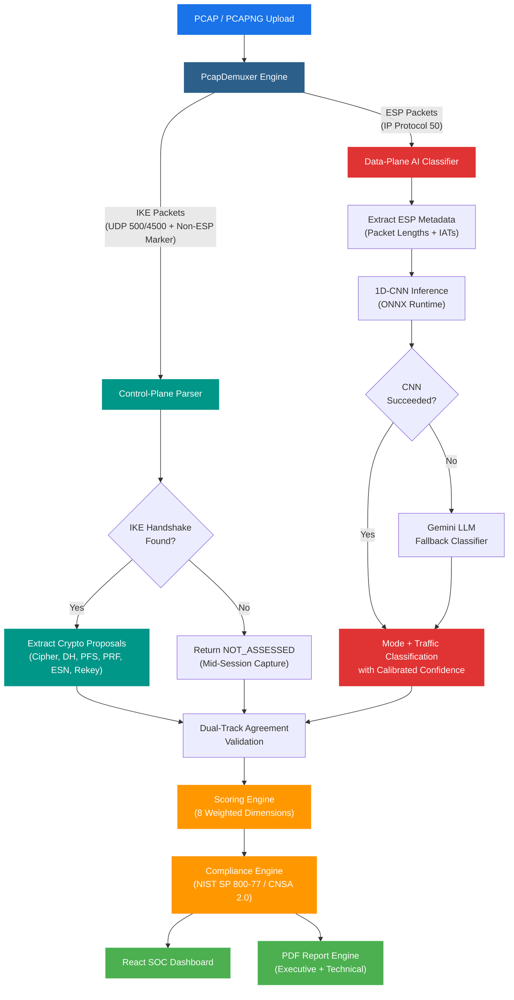
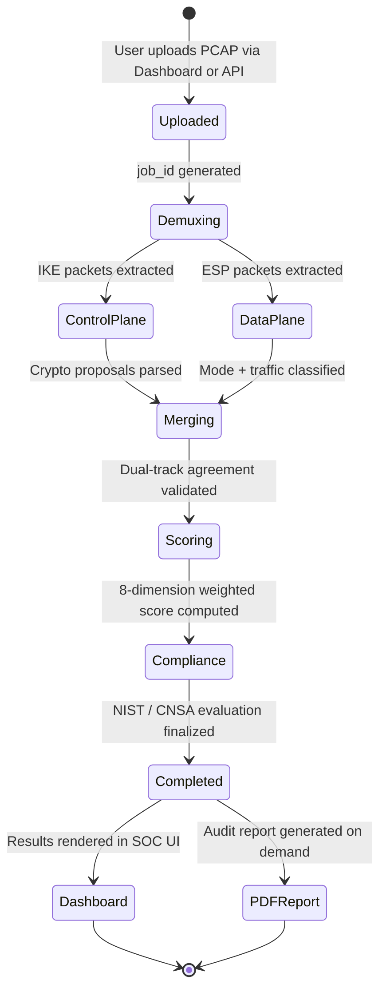
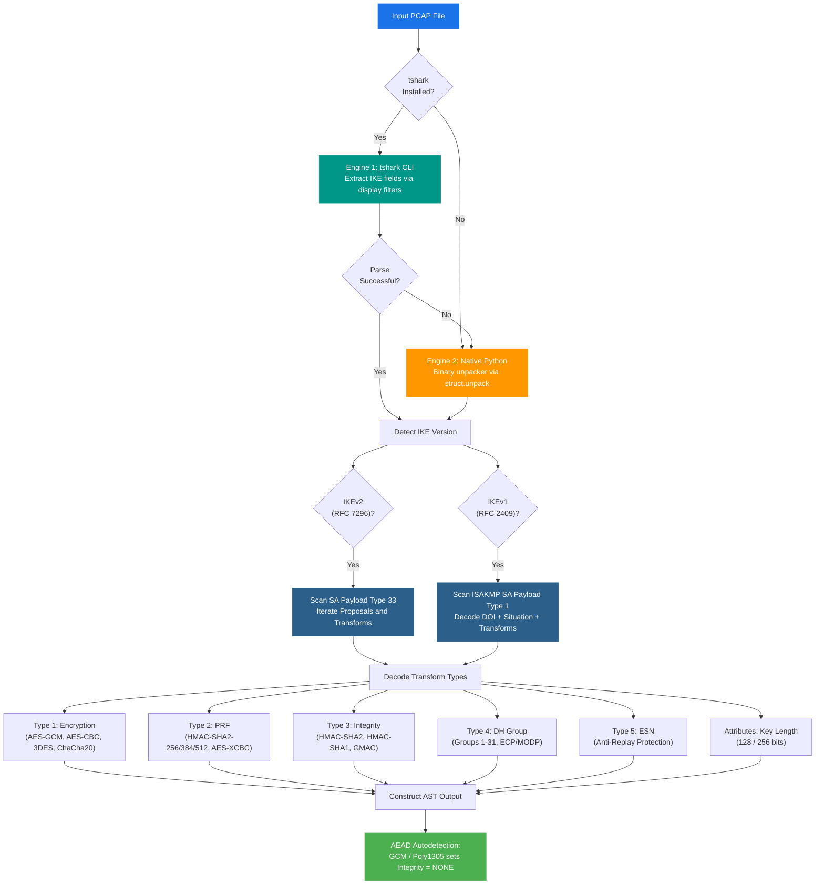
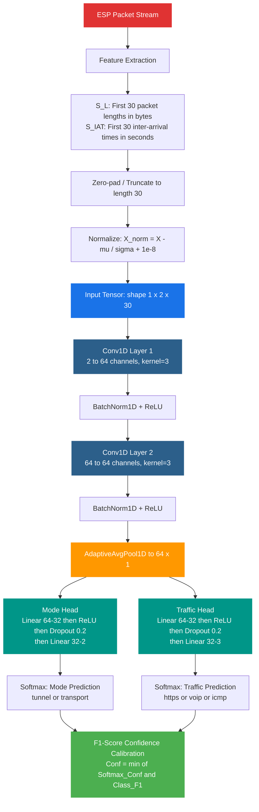
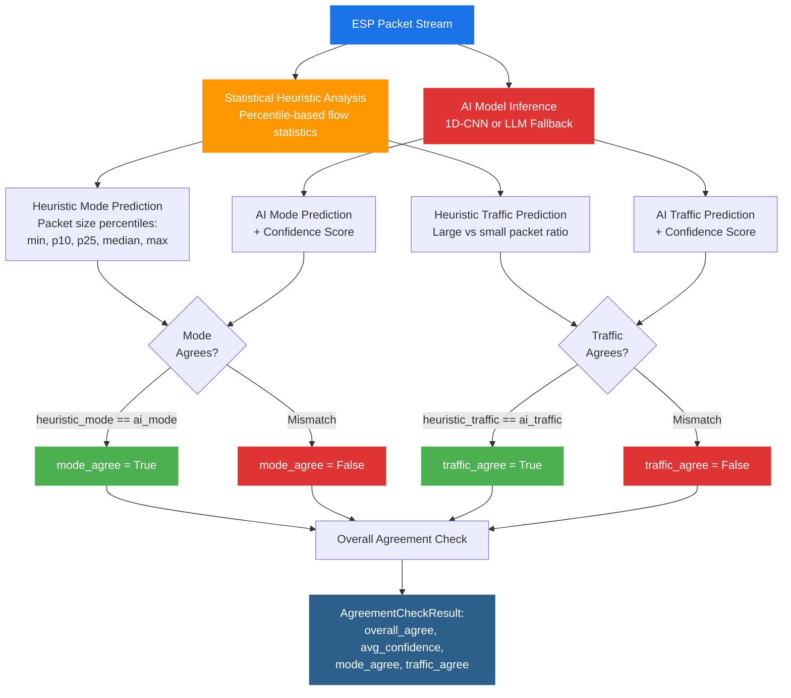
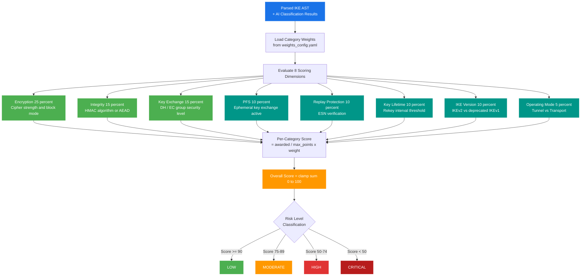
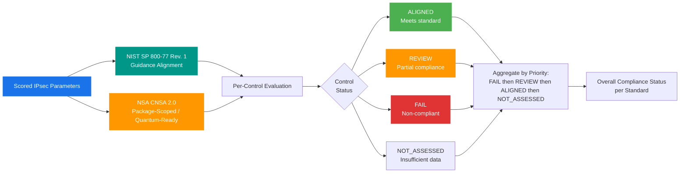
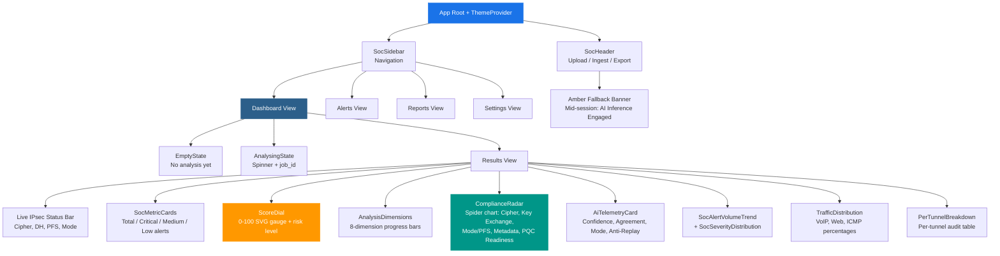
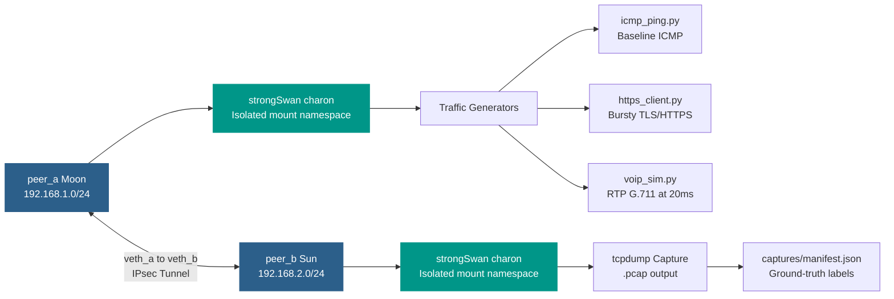
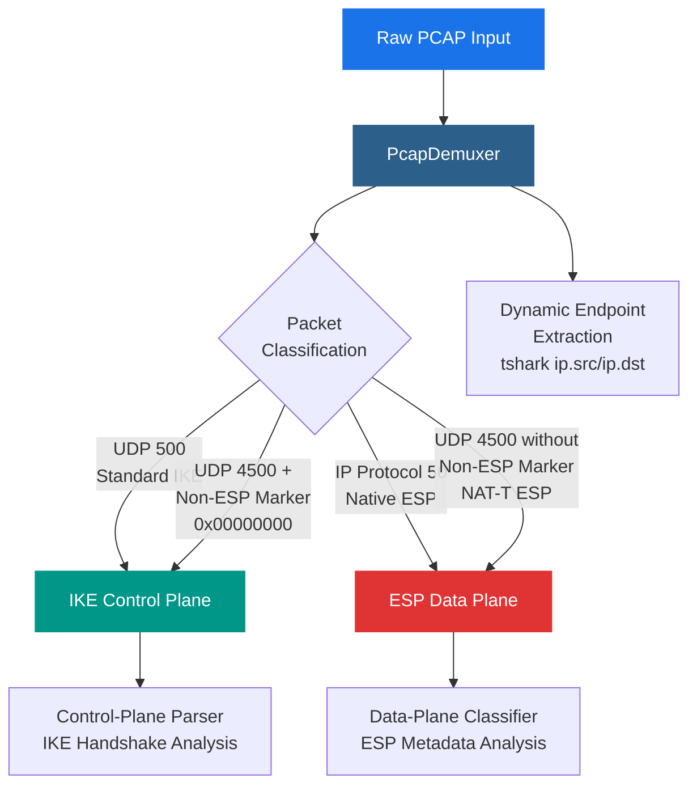

# CryptoLens

> **AI-Driven IPsec Protocol Analysis and Automated Security Assessment Platform**


---

## Table of Contents

- [Executive Overview](#executive-overview)
- [Demo Video](#demo-video)
- [Architecture Pipeline](#architecture-pipeline)
- [Analysis Lifecycle](#analysis-lifecycle)
- [Control-Plane Parser](#control-plane-parser)
- [Data-Plane AI Classifier](#data-plane-ai-classifier)
- [Dual-Track Agreement Logic](#dual-track-agreement-logic)
- [Security Scoring Engine](#security-scoring-engine)
- [Standards Compliance Engine](#standards-compliance-engine)
- [SOC Dashboard](#soc-dashboard)
- [Ground-Truth Testbed Matrix](#ground-truth-testbed-matrix)
- [Quick Start](#quick-start)
- [Running Verification and Tests](#running-verification-and-tests)
- [API Reference](#api-reference)
- [PCAP Demultiplexer](#pcap-demultiplexer)
- [Ethical Scoping and Privacy Guarantees](#ethical-scoping-and-privacy-guarantees)
- [Project Team and SIH 2026 Domains](#project-team-and-sih-2026-domains)

---

## Executive Overview

**The Problem:** Misconfigured IPsec tunnels often appear fully secure on the wire (encrypted ESP packets with valid sequence numbers) while silently employing deprecated cryptographic algorithms (e.g., 3DES, MD5, SHA-1), vulnerable Diffie-Hellman groups (<2048-bit modulus), or operating without Perfect Forward Secrecy (PFS). Auditing these tunnels passively, without access to private endpoint keys or credentials, has traditionally been impossible.

**The CryptoLens Solution:** CryptoLens is a dual-track security auditing and compliance evaluation platform for IPsec networks that operates with zero decryption. It combines three core subsystems:

1. **Deterministic Control-Plane Parser** -- Dissects cleartext IKEv1/IKEv2 handshakes (RFC 7296 / RFC 2409) using a dual-engine architecture (`tshark` dissector + pure-Python binary unpacker) to reconstruct cryptographic proposals with mathematical precision.
2. **Encrypted Data-Plane AI Classifier** -- When the handshake is unavailable or captured mid-session, a local 1D Convolutional Neural Network (CNN) analyzes numerical flow metadata (packet lengths and inter-arrival times) to classify operating mode and inner traffic type with calibrated confidence.
3. **Automated Compliance and Risk Engine** -- Grades the tunnel against NIST SP 800-77 Rev. 1 and NSA CNSA 2.0, generating a normalized 0-100 security score, risk level, threat matrix, and executive/technical PDF audit reports.

---

## Demo Video

> A full end-to-end walkthrough of CryptoLens covering all pipeline stages, dashboard interactions, and PDF report generation:
>
> **[Watch the CryptoLens Demo Video](https://drive.google.com/file/d/1svhQIZ8qLR4R4qhd-rPO23bJiGCA-W1a/view?usp=drive_link)**

---

## Architecture Pipeline

The complete analysis pipeline from PCAP ingestion through to dashboard rendering and PDF export:



---

## Analysis Lifecycle

The full lifecycle of a PCAP analysis request through the system, from user upload to result delivery:



### Lifecycle Notes

| Stage | Detail |
|---|---|
| **Demuxing** | NAT-Traversal disambiguation: UDP 4500 with Non-ESP Marker (0x00000000) routes to IKE; without marker routes to ESP |
| **Control Plane** | Dual-engine fallback: Engine 1 uses tshark CLI; Engine 2 falls back to native Python binary unpacker |
| **Data Plane** | Dual-model fallback: Primary 1D-CNN via ONNX Runtime; fallback Gemini LLM API |
| **Scoring** | Missing control plane (mid-session capture) returns `NOT_ASSESSED` with INFO-level findings |

---

## Control-Plane Parser

**Location:** `backend/engine/control_plane/ike_parser.py`

The control-plane parser reconstructs cleartext cryptographic proposals from IKE handshakes without relying on endpoint access or private keys. It implements a fallback-tolerant dual-engine architecture:



### Extracted AST Fields

| Field | Description | Example Values |
|---|---|---|
| `ike_version` | Detected IKE protocol version | `IKEv2`, `IKEv1` |
| `encryption_algorithm` | Negotiated cipher suite with key length | `AES-256-GCM`, `AES-128-CBC-128`, `3DES` |
| `integrity_algorithm` | HMAC or AEAD integrity mode | `HMAC-SHA2-256`, `NONE` (AEAD), `HMAC-SHA1-96` |
| `dh_group` | Diffie-Hellman group number | `19` (P-256 ECP), `14` (MODP 2048), `2` (MODP 1024) |
| `prf_algorithm` | Pseudo-Random Function | `PRF_HMAC_SHA2_256`, `PRF_HMAC_SHA1` |
| `pfs_enabled` | Perfect Forward Secrecy active | `true`, `false` |
| `key_lifetime_seconds` | SA rekey interval | `3600`, `28800`, `86400` |
| `replay_protection_enabled` | Extended Sequence Numbers | `true`, `false` |

---

## Data-Plane AI Classifier

**Location:** `backend/engine/data_plane/cnn_model.py`, `backend/engine/data_plane/classifier.py`

### 1D-CNN Architecture

The classifier operates on encrypted ESP traffic metadata without any decryption. It processes only numerical flow statistics:



### Inference Flow

| Step | Process | Detail |
|---|---|---|
| 1 | Session Init | Lazy-load ONNX weights from `weights/cnn_mode_traffic.onnx` |
| 2 | Normalization | Apply mu/sigma from `weights/metrics.json` |
| 3 | Inference | ONNX Runtime CPU-only execution |
| 4 | Softmax | Numerically stable with max-subtraction |
| 5 | Calibration | Cap confidence using per-class F1-scores from validation set |

### LLM Fallback Classifier

When the CNN is unavailable or fails, CryptoLens falls back to the Gemini LLM API (`gemini-3.8-flash`, temperature 0.1) with domain-grounded heuristic prompting:

| Traffic Type | Heuristic Signature |
|---|---|
| **HTTPS** | Bursty, variable packet sizes (500-1500 bytes) |
| **VoIP** | Small, constant sizes (150-300 bytes), regular 20ms cadence |
| **ICMP** | Small payloads (<100 bytes), sparse 0.5-1.0s intervals |
| **Tunnel vs Transport** | Outer IP encapsulation adds 20-40 bytes overhead |

---

## Dual-Track Agreement Logic

**Location:** `backend/engine/inference_pipeline.py`

The inference pipeline cross-validates AI predictions against statistical heuristics to flag low-confidence inferences:



### Heuristic Discrimination Signals

| Signal | Threshold | Weight |
|---|---|---|
| Minimum packet size >= 120 bytes | Tunnel indicator | +2 |
| p10 >= 120 bytes | Tunnel indicator | +1 |
| Median >= 155 bytes | Tunnel indicator | +2 |
| p25 >= 130 bytes | Tunnel indicator | +1 |
| Large packets (>= 600B) ratio | HTTPS vs VoIP/ICMP | Variable |

---

## Security Scoring Engine

**Location:** `backend/scoring/scoring_engine.py`

### Scoring Computation Flow



### Scoring Formula

For each category `c` across all 8 dimensions:

```
Score_c = (raw_awarded_points_c / max_rule_points_c) * category_weight_c

Overall Security Score = round(clamp(sum(Score_c for all c), 0.0, 100.0), 2)
```

### Edge Cases and Robustness Rules

| Scenario | Behavior |
|---|---|
| **Missing Control Plane** (mid-session PCAP) | Returns `score: null`, `risk_level: NOT_ASSESSED`, INFO-level findings |
| **AEAD Cipher Detected** (AES-GCM, ChaCha20-Poly1305) | Integrity mapped to `AEAD`, full 15 points awarded |
| **Rekey Lifetime < 60s** | Flagged as corrupted/adversarial input (`INVALID_KEY_LIFETIME`, Severity MEDIUM, 0 points) |
| **Rekey Lifetime > 86,400s** | Exceeds 24-hour standard maximum |

---

## Standards Compliance Engine

**Location:** `backend/scoring/compliance_engine.py`, `compliance_standards.yaml`



### Standards Criteria

| Criterion | NIST SP 800-77 Rev. 1 | NSA CNSA 2.0 |
|---|---|---|
| **IKE Version** | IKEv2 required | IKEv2 mandated |
| **Encryption** | AEAD (AES-256-GCM) or AES-CBC with SHA-2 | AES-256-GCM mandated |
| **Integrity** | SHA-2 HMACs (SHA-256/384/512) | HMAC-SHA-384 / HMAC-SHA-512 |
| **DH Group** | Groups >= 14 (Groups 19/20 preferred) | Group 20 (384-bit ECP) mandated |
| **PFS** | Enabled | Enabled |
| **Replay Protection** | Enabled | Enabled |
| **Deprecated Suites** | 3DES, SHA-1, DH Group 2 flagged | Explicit FAIL for 3DES, SHA-1, DH-2, IKEv1 |

---

## SOC Dashboard

**Location:** `src/App.jsx`, `src/components/`

Built with React 19, Vite 8, Tailwind CSS v4, and Recharts. Supports dark mode and light mode themes.

### Dashboard Component Architecture



### Dashboard Features

| Component | Description |
|---|---|
| **ScoreDial** | Circular SVG gauge (0-100), animated score transitions, risk status badge |
| **ComplianceRadar** | Recharts spider radar comparing 5 compliance axes |
| **AiTelemetryCard** | AI confidence, heuristic agreement flag, predicted mode, anti-replay |
| **TrafficDistribution** | Inner traffic profiling with percentage bars and packet counts |
| **PerTunnelBreakdown** | Per-tunnel table: encryption, DH group, PFS, mode, traffic type |
| **Amber Banner** | Triggered when control-plane handshake is unavailable |
| **Telemetry Polling** | 1.5-second polling loop on `/api/v1/results/{job_id}` |

---

## Ground-Truth Testbed Matrix

CryptoLens ships with 7 reference configurations verified against NIST SP 800-77 and NSA CNSA 2.0:

| ID | Name | Cipher | Hash | DH Group | PFS | Score | Risk |
|---|---|---|---|---|---|---|---|
| `config_01` | Hardened Tunnel | AES-256-GCM | AEAD | Group 19 (P-256) | ON | **100.0** | LOW |
| `config_02` | Standard Secure | AES-128-GCM | AEAD | Group 14 (MODP 2048) | ON | **95.0** | LOW |
| `config_03` | CBC Legacy Auth | AES-256-CBC | SHA2-256 | Group 14 (MODP 2048) | ON | **90.0** | MODERATE |
| `config_04` | Weak Integrity | AES-128-CBC | SHA-1 | Group 5 (MODP 1536) | OFF | **60.0** | HIGH |
| `config_05` | Deprecated Transport | 3DES | SHA-1 | Group 2 (MODP 1024) | OFF | **45.0** | CRITICAL |
| `config_06` | Insecure Tunnel | 3DES | SHA-1 | Group 2 (MODP 1024) | OFF | **45.0** | CRITICAL |
| `config_07` | Legacy IKEv1 Tunnel | 3DES | SHA-1 | Group 2 (MODP 1024) | OFF | **45.0** | CRITICAL |

### Testbed Infrastructure



---

## Quick Start

### Option 1: Docker Compose (Recommended)

```bash
# Clone the repository
git clone https://github.com/shreyashsinha73-ctrl/Cryptolens.git
cd Cryptolens

# Configure environment variables
cp .env.example .env

# Launch the entire stack
docker-compose up --build -d
```

| Service | URL |
|---|---|
| SOC React Dashboard | [http://localhost:5173](http://localhost:5173) |
| FastAPI Documentation | [http://localhost:8000/docs](http://localhost:8000/docs) |
| Backend Health Check | [http://localhost:8000/api/v1/health](http://localhost:8000/api/v1/health) |

### Option 2: Local Development Setup

#### 1. System Prerequisites

- **OS:** Linux (Ubuntu 22.04+ / Debian 12 recommended)
- **Python:** 3.10 or higher
- **Node.js:** v18+ with npm
- **Wireshark CLI:** tshark (version 3.6.2+)

```bash
sudo apt-get update
sudo apt-get install -y tshark python3-venv python3-pip
```

#### 2. Backend and Virtual Environment

```bash
python3 -m venv .venv
source .venv/bin/activate
pip install --upgrade pip
pip install -r requirements.txt
uvicorn backend.main:app --host 0.0.0.0 --port 8000 --reload
```

#### 3. Frontend (React + Vite)

In a separate terminal:

```bash
npm install
npm run dev
```

Open [http://localhost:5173](http://localhost:5173) in your browser.

---

## Running Verification and Tests

### Full Pipeline Automated Regression

```bash
source .venv/bin/activate
python3 scripts/test_end_to_end.py
```

Expected output:

```
======================================================================
 CryptoLens End-to-End Integration Test
======================================================================

[Stage 1: Testbed Output Verification]
[+] Found 6 PCAP files in captures/
[+] Ground-truth manifest contains 6 labeled configurations
[+] Using test capture: config_01_tunnel_aes256gcm_dh19_pfson_all.pcap

[Stage 2: Capture and Demux Verification]
[+] Demux Result: Total=590, IKE=4, ESP=248

[Stage 3: Control-Plane AST Parser Verification]
[+] Parsed IKE Version:  IKEv2
[+] Encryption Cipher:  AES-GCM-256
[+] Integrity Algo:     NONE
[+] Diffie-Hellman:     Group 19
[+] PFS Enabled:        True
[+] Replay Protection:  True

[Stage 3: Data-Plane AI Traffic Analyzer Verification]
[+] Heuristic Mode:     tunnel
[+] AI Mode Prediction: tunnel
[+] AI Confidence:      0.93
[+] Agreement Flag:     True
[+] Detected Traffic:   4 classes identified

[Stage 3: Security Scoring and Compliance Engine Verification]
[+] Security Score:     100.0 / 100
[+] Risk Level:         LOW
[+] Threat Findings:    0 vulnerabilities cataloged
[+] NIST SP 800-77:     ALIGNED
[+] NSA CNSA 2.0:       REVIEW

======================================================================
 ALL PIPELINE STAGES INTEGRATED AND VERIFIED SUCCESSFULLY!
======================================================================
```

### Individual Pipeline Commands

| Stage | Command |
|---|---|
| **Demux PCAP** | `python3 -m backend.capture.demux captures/config_01_tunnel_aes256gcm_dh19_pfson_all.pcap -o /tmp/demux_out` |
| **Parse IKE AST** | `python3 -m backend.engine.control_plane.ike_parser captures/config_01_tunnel_aes256gcm_dh19_pfson_all.pcap --json` |
| **Generate PDF Report** | `curl -X POST http://localhost:8000/api/v1/report/generate -H 'Content-Type: application/json' -d '{"job_id":"demo","report_type":"technical"}' -o report.pdf` |
| **Retrain CNN** | `python3 backend/engine/data_plane/verify.py --skip-venv --epochs 50 --configs 6 --runs-per-combo 20` |

---

## API Reference

| Method | Endpoint | Description |
|---|---|---|
| `POST` | `/api/v1/analyze` | Upload PCAP for analysis. Returns `job_id` with HTTP 202. |
| `GET` | `/api/v1/results/{job_id}` | Poll analysis results (summary, control/data plane, scores, compliance). |
| `GET` | `/api/v1/report/{job_id}/pdf?type=executive` | Generate and stream PDF audit report. |
| `GET` | `/api/v1/capture/testbed` | List available testbed captures from manifest. |
| `POST` | `/api/v1/capture/ingest?force=false` | Batch auto-ingest all testbed PCAPs. |
| `POST` | `/api/v1/capture/ingest/{config_id}?force=false` | Ingest and score a single capture by config ID. |
| `GET` | `/api/v1/capture/status` | Check auto-ingest registry status. |

---

## PCAP Demultiplexer

**Location:** `backend/capture/demux.py`

The demultiplexer separates control-plane and data-plane traffic from mixed PCAP captures:



---

## Ethical Scoping and Privacy Guarantees

> **Dual-Use and Privacy Notice:**
> CryptoLens is designed strictly for internal enterprise self-assessment, network auditing, and defense compliance.

| Guarantee | Description |
|---|---|
| **Zero Decryption** | CryptoLens never attempts to break, crack, or decrypt encrypted ESP payloads. |
| **Zero Plaintext Inspection** | Only RFC-standard cleartext handshake headers (IKE SA proposals) and ESP metadata (frame lengths, timing) are analyzed. |
| **Privacy Preservation** | All IP addresses, MAC addresses, and localized identifiers are sanitized before any inference processing. |

---

## Project Team and SIH 2026 Domains

| Domain | Scope |
|---|---|
| **Testbed Engineering** | Containerized strongSwan topologies and reproducible traffic matrix generation |
| **Control-Plane Parser** | Deterministic IKEv1/IKEv2 binary unpacker and proposal extraction |
| **Data-Plane Inference** | 1D-CNN neural flow classifier, ONNX runtime integration, and confidence calibration |
| **Scoring and Compliance** | Mathematical security scoring against NIST SP 800-77 Rev. 1 and NSA CNSA 2.0 |
| **SOC Dashboard** | React, Tailwind CSS, Vite high-contrast SOC analytics portal |
| **Reporting Engine** | Automated PDF generation with executive summaries and technical remediation blueprints |

---

## License

This project is licensed under the MIT License.
