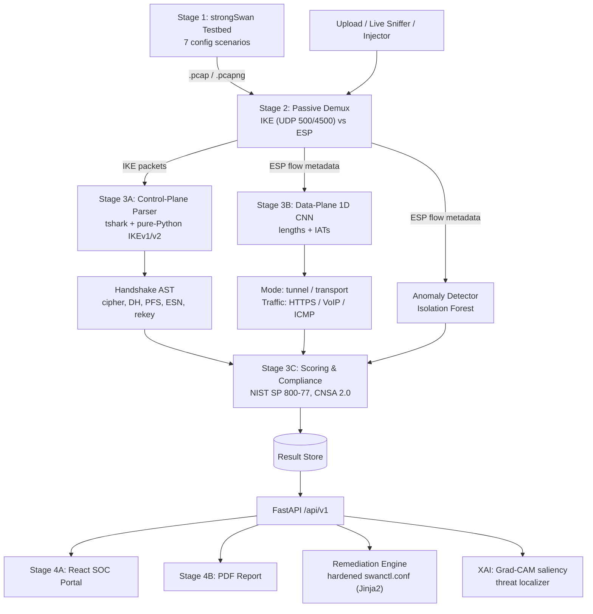
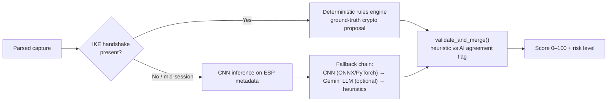
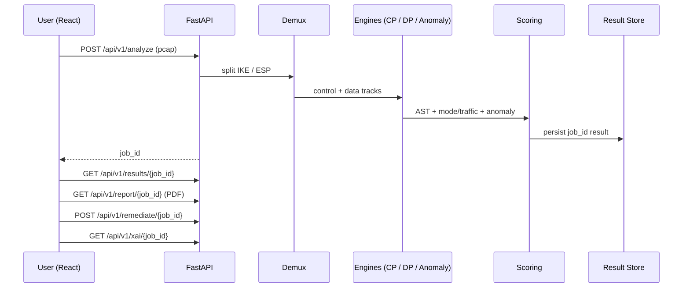
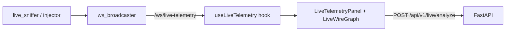
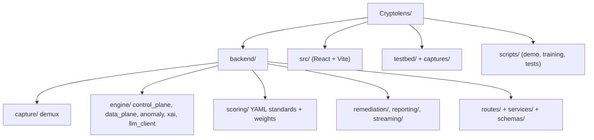

# CryptoLens
> **AI-Driven IPsec Protocol Analysis & Automated Security Assessment Platform**


---

## 📌 Executive Overview

**The Problem:** Misconfigured IPsec tunnels often look completely secure on the wire (encrypted ESP packets with valid sequence numbers) while silently employing deprecated cryptographic algorithms (e.g. 3DES, MD5, SHA-1), vulnerable Diffie-Hellman groups (<2048-bit modulus), or operating without Perfect Forward Secrecy (PFS). Auditing these tunnels passively without access to private endpoint keys or credentials has traditionally been impossible.

**The CryptoLens Solution:** **CryptoLens** is a dual-track security auditing and compliance evaluation platform for IPsec networks:
1. **Deterministic Control-Plane Parser:** Dissects cleartext IKEv1 / IKEv2 handshakes (RFC 7296 / RFC 2409) using a dual-engine architecture (`tshark` dissector + pure Python binary unpacker) to reconstruct cryptographic proposals with mathematical precision.
2. **Encrypted Data-Plane AI Classifier:** When the handshake is withheld or captured mid-session, a local **1D Convolutional Neural Network (CNN)** analyzes numerical flow metadata ($S_L$ packet lengths and $S_{IAT}$ inter-arrival times) to classify operating mode (**Tunnel vs. Transport**) and inner application traffic (**HTTPS, VoIP, ICMP**) with calibrated confidence.
3. **Automated Compliance & Risk Engine:** Grades the tunnel against **NIST SP 800-77 Rev. 1** and **NSA CNSA 2.0**, generating a normalized 0–100 security score, risk level, threat matrix, and executive/technical PDF audit reports.

---

## 🏗️ Architecture Pipeline

### 1. End-to-End Pipeline



### 2. Dual-Track Analysis Logic



### 3. Backend Request Sequence



### 4. Live Telemetry



### 5. Repository Map



### 6. Backend API Summary

| Method | Endpoint | Purpose |
|---|---|---|
| POST | `/api/v1/analyze` | Upload PCAP, run full pipeline |
| GET | `/api/v1/results/{job_id}` | Fetch stored result |
| GET | `/api/v1/report/{job_id}` | Download PDF audit |
| GET/POST | `/api/v1/capture/*` | Testbed listing, ingest, status |
| POST | `/api/v1/remediate/{job_id}` | Hardened config generation |
| GET | `/api/v1/xai/{job_id}` | Explainability output |
| WS | `/ws/live-telemetry` | Live packet stream |
| POST | `/api/v1/live/*` | start / stop / analyze / inject / simulate |

---

## 🚀 End-to-End Quick Start

You can run CryptoLens either via **Docker Compose** (one-command turnkey deployment) or **Locally** (for development and debugging).

### Option 1: Docker Compose (Recommended for Production & Demos)

1. **Clone the repository:**
   ```bash
   git clone https://github.com/shreyashsinha73-ctrl/Cryptolens.git
   cd Cryptolens
   ```

2. **Configure environment variables:**
   ```bash
   cp .env.example .env
   # Edit .env if using cloud LLM fallback; local 1D CNN runs out of the box with zero external keys
   ```

3. **Launch the entire stack:**
   ```bash
   docker-compose up --build -d
   ```

4. **Access the services:**
   - **SOC React Dashboard:** [http://localhost:5173](http://localhost:5173)
   - **FastAPI Documentation:** [http://localhost:8000/docs](http://localhost:8000/docs)
   - **Backend Health Check:** [http://localhost:8000/api/v1/health](http://localhost:8000/api/v1/health)

---

### Option 2: Local Development Setup

#### 1. System Prerequisites
- **OS:** Linux (Ubuntu 22.04+ / Debian 12 recommended)
- **Python:** 3.10 or higher
- **Node.js:** v18+ and `npm`
- **Wireshark CLI:** `tshark` (version 3.6.2+)
  ```bash
  sudo apt-get update
  sudo apt-get install -y tshark python3-venv python3-pip
  ```

#### 2. Backend & Virtual Environment Setup
```bash
# 1. Create and activate virtual environment
python3 -m venv .venv
source .venv/bin/activate

# 2. Install Python dependencies
pip install --upgrade pip
pip install -r requirements.txt

# 3. Start the FastAPI backend server
uvicorn backend.main:app --host 0.0.0.0 --port 8000 --reload
```

#### 3. Frontend Setup (React + Vite)
In a separate terminal:
```bash
# 1. Install frontend dependencies
npm install

# 2. Start the Vite development server
npm run dev
```
Open [http://localhost:5173](http://localhost:5173) in your browser.

---

## 🧪 Running Verification & Tests End-to-End

### 1. Comprehensive Defense Audit & Demo Verification
Run the 5-stage automated defense audit and live demonstration harness:
```bash
# Run 5-stage defense audit verification (PCAP Ingestion, Dual-Track, XAI Grad-CAM, Anti-Replay, Remediation)
./scripts/demo_audit.sh

# Run full 62-test regression test suite
.venv/bin/pytest tests
```

### 2. Full Pipeline Automated Regression (Legacy Stages)
Run the automated end-to-end integration test harness:
```bash
# Ensure venv is activated
source .venv/bin/activate

# Run end-to-end integration test
python3 scripts/test_end_to_end.py
```
**Expected Verification Output:**
```text
======================================================================
 CryptoLens End-to-End Integration Test
======================================================================

[Stage 1: Testbed Output Verification]
[+] Found 6 PCAP files in captures/
[+] Ground-truth manifest contains 6 labeled configurations
[+] Using test capture: config_01_tunnel_aes256gcm_dh19_pfson_all.pcap

[Stage 2: Capture & Demux Verification]
[+] Demux Result: Total=590, IKE=4, ESP=248

[Stage 3: Control-Plane AST Parser Verification]
[+] Parsed IKE Version:  IKEv2
[+] Encryption Cipher:  AES-GCM-256
[+] Integrity Algo:     NONE
[+] Diffie-Hellman:     Group 19
[+] PFS Enabled:        True
[+] Replay Protection:  True

[Stage 3: Data-Plane AI Traffic Analyzer Verification]
[+] Heuristic Mode:     tunnel
[+] AI Mode Prediction: tunnel
[+] AI Confidence:      0.93
[+] Agreement Flag:     True
[+] Detected Traffic:   4 classes identified

[Stage 3: Security Scoring & Compliance Engine Verification]
[+] Security Score:     100.0 / 100
[+] Risk Level:         LOW
[+] Threat Findings:    0 vulnerabilities cataloged
[+] NIST SP 800-77:     ALIGNED
[+] NSA CNSA 2.0:       REVIEW

======================================================================
 ALL PIPELINE STAGES INTEGRATED AND VERIFIED SUCCESSFULLY!
======================================================================
```

---

### 2. Individual Pipeline Component Commands

You can run every stage independently via CLI:

#### A. Demux a PCAP into Control and Data Tracks (Stage 2)
```bash
python3 -m backend.capture.demux captures/config_01_tunnel_aes256gcm_dh19_pfson_all.pcap -o /tmp/demux_out
```

#### B. Parse Control-Plane Handshake into JSON AST (Stage 3A)
```bash
python3 -m backend.engine.control_plane.ike_parser captures/config_01_tunnel_aes256gcm_dh19_pfson_all.pcap --json
```

#### C. Score a Handshake AST via Rules Engine (Stage 3C)
```bash
python3 -m backend.engine.control_plane.ike_parser captures/config_01_tunnel_aes256gcm_dh19_pfson_all.pcap --json \
  | python3 -m backend.engine.control_plane.rules_engine - --standard nist --json
```

#### D. Generate an Audit PDF Report (Stage 4B)
```bash
curl -X POST http://localhost:8000/api/v1/report/generate \
  -H 'Content-Type: application/json' \
  -d '{"job_id":"demo","report_type":"technical"}' \
  -o CryptoLens_Audit_Report.pdf
```

#### E. Retrain the 1D CNN Local Classifier from Scratch
```bash
python3 backend/engine/data_plane/verify.py --skip-venv --epochs 50 --configs 6 --runs-per-combo 20
```

---

## 📊 Ground-Truth Testbed Matrix (`config_matrix.yaml`)

CryptoLens includes 7 reference configurations mapping to NIST SP 800-77 and NSA CNSA 2.0:

| ID | Name | Cipher | Hash | DH Group | PFS | Score | Risk Status |
|---|---|---|---|---|---|---|---|
| `config_01` | Hardened Tunnel | AES-256-GCM | AEAD | Group 19 (P-256) | ON | **100.0** | 🟢 LOW |
| `config_02` | Standard Secure | AES-128-GCM | AEAD | Group 14 (MODP 2048) | ON | **95.0** | 🟢 LOW |
| `config_03` | CBC Legacy Auth | AES-256-CBC | SHA2-256 | Group 14 (MODP 2048) | ON | **90.0** | 🟡 MODERATE |
| `config_04` | Weak Integrity | AES-128-CBC | SHA-1 | Group 5 (MODP 1536) | OFF | **60.0** | 🟠 HIGH |
| `config_05` | Deprecated Transport | 3DES | SHA-1 | Group 2 (MODP 1024) | OFF | **45.0** | 🔴 CRITICAL |
| `config_06` | Insecure Tunnel | 3DES | SHA-1 | Group 2 (MODP 1024) | OFF | **45.0** | 🔴 CRITICAL |
| `config_07` | Legacy IKEv1 Tunnel | 3DES | SHA-1 | Group 2 (MODP 1024) | OFF | **45.0** | 🔴 CRITICAL |

---

## 🎥 Demo Video Guide (10-Segment Sequence)

To record an end-to-end demo video following [CryptoLens_Testing_and_Demo_Plan.md](CryptoLens_Testing_and_Demo_Plan.md):

| Segment | Screen View | Action / Command | Expected Frontend Result |
|---|---|---|---|
| **1. Hook** | Split-screen | Wireshark vs Dashboard | Side-by-side: Wireshark looks encrypted, CryptoLens shows Score **45 / 100 CRITICAL**. |
| **2. Bring-Up** | Terminal & Browser | `docker-compose up -d` | Clean dashboard in Empty State ("No Analysis Yet"). |
| **3. Good Tunnel** | Dashboard | Upload `config_01...pcap` | Live IPsec Tunnel Status flips to `TUNNEL ACTIVE & AUDITED` (AES-GCM-256 / DH19 / PFS ON). |
| **4. Good Score** | Dashboard | Inspect Live Results | Score dial counts up to **100 / 100**, radar chart expands, threat matrix shows 0 vulnerabilities. |
| **5. Bad Tunnel** | Dashboard | Upload `config_06...pcap` | Tunnel status immediately updates to `3DES / DH2 / PFS OFF`. |
| **6. Score Collapse** | Dashboard | Watch score transition | Score dial animates down from 100 to **45.0 CRITICAL**; Sweet32 and weak DH findings turn red. |
| **7. PDF Export** | PDF Viewer | Click "PDF Report" button | Downloads executive & technical PDF containing threat table and auto-remediation steps. |
| **8. AI Fallback** | Dashboard | Upload mid-session capture | Amber banner triggers: `⚠ Control-Plane Handshake Unavailable`. CNN outputs `Tunnel Mode` at 86% confidence. |
| **9. Replay Test** | Dashboard | Run `inject_duplicate_esp.py` | Active Replay Protection indicator card flips to `CONFIRMED` with green badge. |
| **10. Close** | Slide | Present closing slide | Recap dual-plane architecture, automated compliance, and air-gapped readiness. |

---

## 🔒 Ethical Scoping & Privacy Guarantees

> **⚠️ Dual-Use & Privacy Notice**
> CryptoLens is designed strictly for **internal enterprise self-assessment, network auditing, and defense compliance**.

- **Zero Decryption:** CryptoLens never attempts to break, crack, or decrypt encrypted ESP payloads.
- **Zero Plaintext Inspection:** Only RFC-standard cleartext handshake headers (IKE SA proposals) and ESP metadata (frame lengths, timing) are analyzed.
- **Privacy Preservation:** All IP addresses, MAC addresses, and localized identifiers are sanitized before any inference processing.

---

## 👥 Project Team & SIH 2026 Domains

- **Testbed Engineering:** Containerized strongSwan topologies and reproducible traffic matrix generation.
- **Control-Plane Parser:** Deterministic IKEv1/IKEv2 binary unpacker and proposal extraction.
- **Data-Plane Inference:** 1D CNN neural flow classifier, ONNX runtime integration, and confidence calibration.
- **Scoring & Compliance:** Mathematical security scoring against NIST SP 800-77 Rev. 1 & NSA CNSA 2.0.
- **SOC Dashboard:** React, Tailwind CSS, Vite high-contrast SOC analytics portal.
- **Reporting Engine:** Automated PDF generation with executive summaries and technical remediation blueprints.
